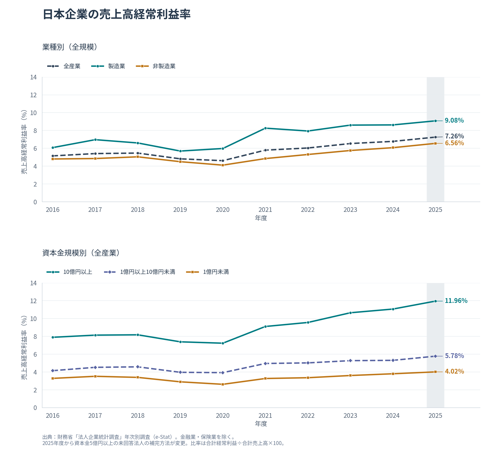

# 日本企業の売上高経常利益率

財務省「法人企業統計調査」の年次別調査を用い、2016〜2025年度の10年間の利益率を可視化します。

このサイトはGPT 6 Astraにより構築されました。

**公開ページ：<https://katzkawai.org/kklab-corporate-ordinary-profit/>**

GitHub Pagesで配信しています。`katzkawai.github.io` のプロジェクトURLからも、アカウントに設定済みの独自ドメインへ転送されます。



## 比較できるもの

- 全産業（金融業・保険業を除く）、製造業、非製造業
- 資本金10億円以上、1億円以上10億円未満、1億円未満
- 業種別グラフは資本金規模を、規模別グラフは業種を切り替え可能
- PNG・SVGのグラフ、数値表、原データと集計済みCSV

## 実行

[uv](https://docs.astral.sh/uv/) と日本語フォントを用意し、リポジトリ一式を取得してください。Pythonスクリプトはすべて **PEP 723** の依存関係メタデータを持ちます。仮想環境の手動作成や `pip install` は不要です。

```bash
git clone https://github.com/katzkawai/kklab-corporate-ordinary-profit.git
cd kklab-corporate-ordinary-profit
uv run build.py
```

`pandas` で集計し、`matplotlib` で描画します。原データは同梱しているため、通常の生成時にe-Statへの接続は不要です（初回の依存パッケージ取得は必要）。生成先は `docs/` です。`docs/index.html` は直接ブラウザで開けます。

Linuxで日本語フォントがない場合：

```bash
sudo apt-get install fonts-noto-cjk
```

Noto Sans CJK JP、IPAexGothic、IPAGothic、游ゴシック、ヒラギノ角ゴシック、メイリオのいずれかを自動選択します。フォントがない場合は文字化けした図を作らず停止します。

最新データの再取得：

```bash
uv run build.py --refresh
uv run tests/test_analysis.py
```

`--refresh` はe-Stat公式サイトの**公開CSVダウンロード機能**を利用します。認証付き統計APIを使わないため、APIキーは不要です。公式の項目定義から最新の年度を検出し、末尾10年度分を取得します。取得エラー・欠測・分類変更はエラーとして通知し、架空データやゼロで埋めません。データは検証完了後に保存します。e-Statのウェブ機能が変更された場合は取得処理の修正が必要ですが、同梱CSVからの再生成は可能です。

## 公開方法

GitHubリポジトリの **Settings → Pages** で、Sourceを **Deploy from a branch**、Branchを **main / docs** に設定します。`docs/` には必要なファイル一式と `.nojekyll` があり、外部CDNやサーバー処理は不要です。

更新時は `uv run build.py --refresh` の出力・検証結果・表示を確認し、`data/` と `docs/` の変更をコミットして `main` にpushします。自動でデータを差し替えるスケジュールは設定していません。

## データと算式

- 出典：[e-Stat 法人企業統計調査・金融業、保険業以外の業種（原数値）](https://www.e-stat.go.jp/dbview?sid=0003060791)
- 統計表ID：`0003060791`。統計コード：`00350600`。年度次の原数値。
- 現在の収録範囲：2016〜2025年度。2025年度分の公表日：2026-09-01。
- 取得日時、原データのSHA-256、検証結果：[data/provenance.json](data/provenance.json)

```text
売上高経常利益率 (%) = 経常利益の母集団推計値 / 売上高の母集団推計値 × 100
```

原表コードは、項目 `045`（売上高）、`048`（営業利益）、`051`（経常利益）、`127`（公表売上高経常利益率）。業種は `104`（全産業・除く金融保険）、`108`（製造業）、`144`（非製造業）。資本金は `26`（全規模）、`25`（10億円以上）、`24`（1億円以上10億円未満）、`19`（1,000万円以上1億円未満）、`16`（1,000万円未満）です。

**1億円未満は `19` と `16` の金額を合算してから比率を計算します。比率の単純平均ではありません。** 資本金で区分しており、中小企業基本法や従業員数による定義とは異なります。

年次別調査の確定決算の計数を使用し、暦年や四半期別調査とは接続しません。個別企業の利益率の平均、連結ベースの利益率、国内本業の営業利益率とも異なります。全産業の集計には純粋持株会社も含まれます。

2025年度から、金融業・保険業を除く資本金5億円以上の未回答法人のうち前年度の回答がある法人について、前年度データによる補完に変更されています。[財務省・補完方法の変更](https://www.mof.go.jp/pri/reference/ssc/summary/kessokuchi_20260630.pdf)。年度をまたぐ比較では、補完方法、母集団・標本、業種や資本金規模の構成変化にも留意してください。

## 読み取れる特徴

1. **長期では全産業の利益率が上昇。** 2016年度の5.15%から2025年度の7.26%へ、2.11ポイント上昇。
2. **業種差には営業外収支が大きく反映。** 2025年度の経常利益率は製造業9.08%、非製造業6.56%。営業利益率は5.49%、5.41%と近く、差の大半は営業外収支の差として説明できる。ただし、個別要因の因果的寄与は特定していない。
3. **規模間の格差が拡大。** 資本金10億円以上と1億円未満の利益率差は、2016年度の4.61ポイントから2025年度の7.94ポイントへ。業種構成などの違いも含む集計上の差。
4. **2020年度の低水準から回復。** 全産業は2020年度4.61%で期間内の最低となり、その後2025年度までに2.64ポイント上昇。差は丸め前の数値から計算。

## 検証

`build.py` は毎回、以下を検査します。

- 原データ600件・10年度の連続性、重複・欠測・0以下の売上高・単位・分類コード
- 公表利益率150点と再計算値の一致（原表は小数1桁のため最大0.05ポイントの丸めを許容）
- 製造業＋非製造業、および互いに重複しない4資本金区分の金額が全体に一致
- 集計結果120件の完全性

`tests/test_analysis.py` は1億円未満の加重集計、破損・重複・欠測・ゼロ売上・不整合の検出、[財務省2025年度報道発表資料](https://www.mof.go.jp/pri/reference/ssc/results/r7.pdf) p.5の経常利益との独立照合を確認します。

## ファイル構成

| パス | 内容 |
|---|---|
| `build.py` | データ取得・検証・集計・グラフ・ページ生成を行うPEP 723スクリプト |
| `data/raw/estat_annual.csv` | e-Statの原データ（メタデータ付き、CP932） |
| `data/ordinary_profit_margin.csv` | 集計済みデータ（UTF-8 BOM付き、金額は百万円） |
| `data/provenance.json` | 出典、取得時点、ハッシュ、検証結果 |
| `web/` | ページのHTMLテンプレート・CSS・JavaScript |
| `docs/` | GitHub Pagesへの公開ファイル一式 |
| `tests/test_analysis.py` | 集計処理の検証用PEP 723スクリプト |

公表データを加工した非公式の可視化です。データの利用条件は[財務省サイトポリシー](https://www.mof.go.jp/about_mof/introduction/copyright.htm)および[e-Stat利用規約](https://www.e-stat.go.jp/terms-of-use)をご確認ください。
